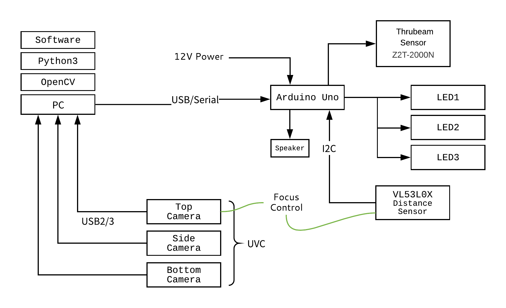

# Open Book Camera v1

汎用的なデバイスで構成される高速な書影撮影システム

## コンセプト

- 書影（本の表示画像）キャプチャ用のスキャナデバイス
- 本を置いたら自動撮影
- 表紙・裏表紙・背の3面を高速撮影（2秒程度）
- ネットワーク接続なしでスタンドアロン動作

## システム構成



## Installation

Windows:

- [Anaconda](https://www.anaconda.com/download/) Python3.7 をインストール
- [libjpeg-turbo](https://libjpeg-turbo.org/Documentation/Documentation) をインストール [libjpeg-turbo-1.5.3-vc64.exe](https://sourceforge.net/projects/libjpeg-turbo/files/1.5.3/libjpeg-turbo-1.5.3-vc64.exe/download)
- [Visual C++ Redistributable Packages for Visual Studio 2013](https://www.microsoft.com/en-US/download/details.aspx?id=40784)をインストール（pyzbarが依存）

```sh
conda install opencv==3.4.2
pip install -r requirements.txt
python capture.py
```

## キーボード操作

| キー | 役割                     |
|------|--------------------------|
| 0    | コントローラーリセット   |
| 1    | 上面のカメラに切り替える |
| 2    | 下面のカメラに切り替える |
| 3    | 背面のカメラに切り替える |
| 4    | 距離センサのテスト       |
| c    | カメラの設定画面を開く   |
| ESC  | システム終了             |
| Enter| 手動撮影                 |

1→c 2→c と操作することで各カメラの設定を順次調整できます。調整結果は保存されません。

## 制御ボード


- Arudinoシールド互換サイズ
- MOSFETによる12V制御回路×4
- 各種センサ向けのコネクタ（2.5mmピッチ・XHシリーズ）
- [Pololu Arduino library for VL53L0X](https://github.com/pololu/vl53l0x-arduino)
- 光電センサ [Z2T-2000N](https://www.optex-fa.jp/products/photo_sensor/amp/z_eco/index.html) を本が置かれたことを検出するセンサとして採用

## UVCカメラ

- [UVC規格](https://en.wikipedia.org/wiki/USB_video_device_class)の汎用的なUSBカメラに対応
- カーリルでは[IPEVO社製V4K](https://www.ipevo.jp/v4k.html)を採用（800万画素）
- 各カメラを独立したUSBポートに接続すること（USBハブを用いた場合は帯域不足となる）

## 注意事項

- 輸送後にはフォーカス設定が変動する場合があります。最適な画質になる設定にソースコードを調整してください。
- 2019年12月購入以降のV4Kにおいて、色温度の設定が自動化できない不具合を確認しています。この問題は[openCV側の不具合](https://github.com/opencv/opencv/issues/13130)の可能性があります。cコマンドによるマニュアル設定をお願いします。
 
## Release History

* 0.0.1 Work in progress
* 1.0.0 正式リリース
* 1.1.0 V4K最新ファームウェアに対応
* 1.2.0 V4K最新ファームウェアに対応