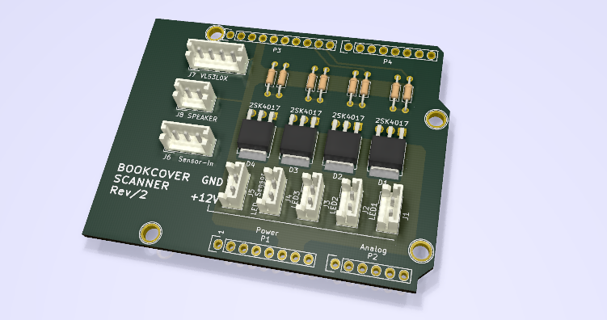

# 書影撮影システム

[![NPM Version][npm-image]][npm-url]
[![Build Status][travis-image]][travis-url]
[![Downloads Stats][npm-downloads]][npm-url]

One to two paragraph statement about your product and what it does.


## Installation

Windows:

```sh
conda install numpy
conda install -c menpo opencv
pip install -r requirements.txt
```

## 制御ボード



- Arudinoシールド互換サイズ
- MOSFETによる12V制御回路×4
- 各種センサ向けのコネクタ（2.5mmピッチ・XHシリーズ）
- [Pololu Arduino library for VL53L0X](https://github.com/pololu/vl53l0x-arduino)
- 光電センサ [Z2T-2000N](https://www.optex-fa.jp/products/photo_sensor/amp/z_eco/index.html) を本が置かれたことを検出するセンサとして採用

## UVCカメラ

- [UVC規格](https://en.wikipedia.org/wiki/USB_video_device_class)の汎用的なUSBカメラに対応
- 試作機では[IPEVO社製V4K](https://www.ipevo.jp/v4k.html)を採用（800万画素）
- 各カメラを独立したUSBポートに接続すること（USBハブを用いた場合は帯域不足となる場合がある）

## Release History

* 0.0.1
    * Work in progress
